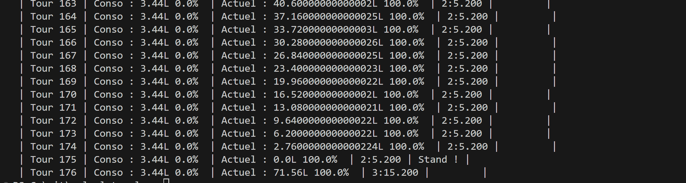
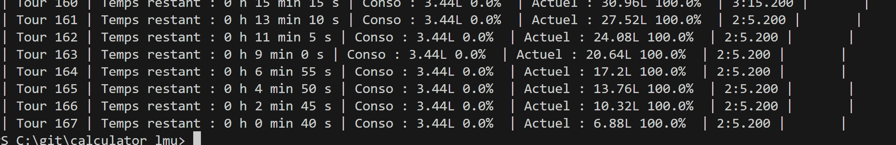

# Observations 
## 07/02/25 : 6h de SPA => 0.1.2

- **Le calcul des tours à l'air cassé**, le jeu donnais ~165 tours alors que le logiciel donnait ~175. La raison est peut-être le temps de pit stop ou la pluie qui est peut-être pris en compte dans le calcul du jeu.
  - *Note de post-Patch : c'était un problème de calcul de chrono par rapport au timer, les secondes se calculaient indépendament en fin de course, sans se préoccuper des minutes et des heures.*
  - Avant :
  
  - Après :
  

- **Problème dans l'organisation des stands** : le marquage de rentrée au stand dans le simulateur de tour est marqué le tour où le carburant atteint 0 alors qu'il devrait marqué le tour d'avant sous peine de panne sèche.
  - *Problème résolu : Se déclenche maintenant juste avant de tour de trop*

- **Problème des digits après la virgule** : au fur et a mesure des calculs, les digits cachée par la machine apparaissent, ce qui rend l'affiche trop dense.
  - *Problème résolu : Fonction dédié pour l'affichage des doubles crée dans `bibliothque\Donnee.java`.*

- **Fluctuations des tours** : les tours ne seront jamais les mêmes, ils seront moins bon que le chrono de référence puis quelques milliéme au début de relais et ~0,3 secondes d'écart en milieu / fin de relais.

- **Donnée des arrêts au stand a rajouter** : faire des tests de mon côté.
  - *Note : Donnée de temps dans la pit lane ( excluant le temps d'arrêt ) en train d'être tester et ajouté dans `bibliothque\Circuit.java`.*