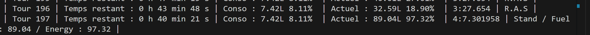
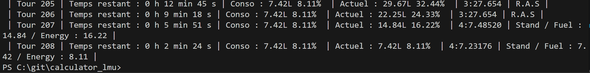

# Observations 

## Branch WorkCalculTour : last commit => "Amélioration Modularité"
## 26/02/26 : 6h de SPA => 0.2.05

- **Problème d'arrêt au stand** : La voiture rentre un tour trop tôt par rapport à ce qui était prévu. Au lieu de rentrer lorsque le carburant actuel est inférieur à la conso, il s'arrête avant.

- **Stand doublé en fin de course** : La voiture rentre deux fois au stand à la fin de la course, augmentant les chronos et faussant les fins de prédiction.
